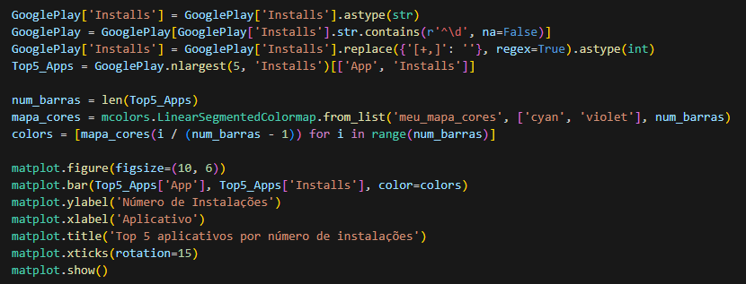
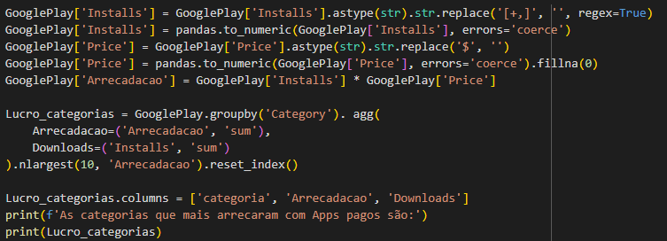
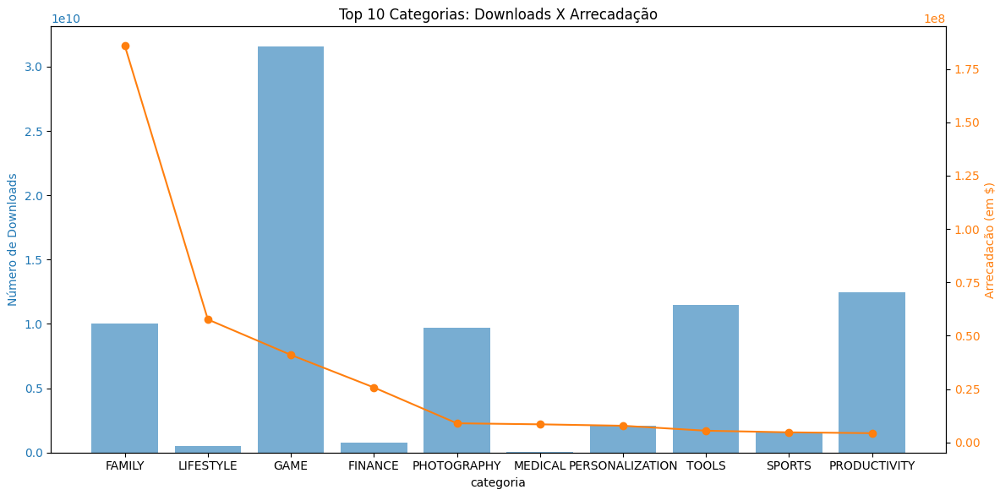
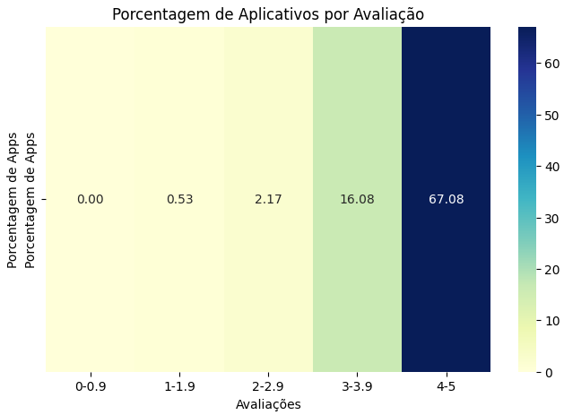
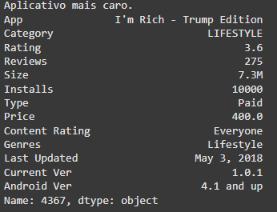
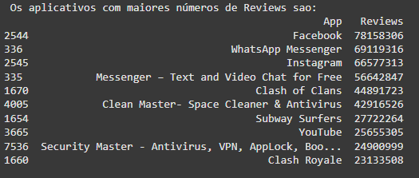

# Etapas
### 1. Organização das Tasks
  ##### Após baixar o banco de dados, e fazer a ligação com meu intepretador, comecei a estruturar como eu resolveria o desafio.
  ##### Os arquivos de entrega do desafio foram alocados na pasta de mesmo nome conforme instruções.

### 2. Importação de bibliotecas
  ##### Primeiramente importei as bibliotecas que usaria no desafio, inicialmente foram apenas pandas e matplotlib porém ao final acabei importando mais ficando da seguinte maneira. 

  ##### Após, comecei a importar o arquivo CSV que seria usado no desafio já se atentando ao tratamento de linhas duplicadas conforme imagem: 
 

### 3. Criação dos cálculos
  ##### O processo de criação se divergiu em alguns pontos a depender do que se era proposto em cada Etapa do desafio:
  ###### Etapa 4 - Ao desenvolver o cálculo que retornaria o app mais caro do DataSet primeiro fiz um tratamento para retirar caracteres monetários e espaços em branco logo converti para tipo float e então busquei na coluna o valor mais alto, tendo retornado o resultado: 
 
  ###### Etapa 5 - O processo na etapa cinco foi mais simples que o anterior, ao criar uma variável "classificação_app" e filtrar aos que eram iguais ao termo "Mature 17+" o resultado retorno porém com valor acima do esperado, então fiz um filtro para remover entradas duplicadas mas dessa vez filtrando pela coluna "App" que erá onde se encontravam os nomes do app garantindo assim que o código retornaria exatamente uma entrada para cada aplicativo, mesmo que fossem de versões de updates diferentes. 
 
  ###### Etapa 6 - Durante o cálculo dos apps com mais Reviews foi necessário o uso da biblioteca Pandas, assim transformei tudo para valores númericos, fiz um leve tratamento de erros e retirei novamente os apps duplicados e defini como 10 o número de entradas a serem listadas.
 
  
### 4. Criação de Gráficos
  ###### Etapa 2 - Ao criar o código para exibir os 5 apps com mais número de instalações usei códigos para transforcação de dados em string, inteiros e substituição de caracteres que não seriam pertinentes ao cálculo. Além disso, para a criação do gráfico fiz uso da biblioteca matplotlib para criar um gráfico que se ajustasse à requisição.
 
  ###### Etapa 3 - Para o gráfico de pizza era necessário apresentar todas as categorias de aplicativos do DataSet e apresentar a frequência com que apareciam, ou seja, a porcentagem de aplicativos pertencentes a elas que estavam presentes no DataSet. Para isso usei um código para contar valores o qual contou o número de vezes que cada categoria se repetia e os nomes das categorias, então criei o gráfico tomando medidas para que continuasse perfeitamente redondo e para que os valores de porcentagem bem como os rótulos fossem apresentados na exibição final.
 

### 5. Etapas 7 e 8 do desafio
  ##### Por serem duas etapas nas quais as atividas tinham ligação entre si, separei a seção para tal exibição:
  ###### A) Para a proposta de listagem desenvolvi uma exibição com foco no valor arrecadado pelos app pagos que mais arrecadaram com suas vendas, sendo a arrecadação em Dólares($) e limitei em 10 itens. Inicialmente transformei os dados de instalação em string para retirar caracteres desncessários e utilizando a biblioteca Pandas, transformei novamente em valores numéricos, além de um leve tratamento de erros. Com a coluna price o processo foi o mesmo e por fim criei a coluna Arrecadacao na qual multiplicava as colunas Installs pela Price.
  ###### Agrupei todo o conteudo e efetuei somas nas colunas Arrecadacao e Installs, sendo a última renomeada para Downloads e por fim imprimi os resultados. 
 
  ###### O gráfico escolhido para esses dados foi um gráfico de colunas e linhas em que as barras representavam as Categorias e Número de Downloads e a linha a Arrecadação (em $)
 
  ###### B) Já na proposta de valor exibi, baseado em suas notas de avaliação de usuários, os apps que se encaixavam em cada faixa de avaliação sendo a escala de 1 a 5. Para tal, transformei todos os valores da coluna "Ratings" em valores numéricos e como anteriormente, propus um tratamento de erros, então especifiquei os limites e faixas de avaliação. Fiz com que a biblioteca Pandas agrupasse os aplicativos pelas faixas de avaliação que determinei anteriormente e então somei também a quantidade de entradas do DataSet para saber qual o número total de aplicativos cadastrados para assim criar corretamente as porcentagens, essa coluna chamei de Avaliações.
  ###### Para contar cada faixa de avaliação usei o código value_counts() e então sort_index() para transformar os valores novamente em colunas. para gerar as porcentagens dividi cada faixa pela quantidade de apps nelas e multipliquei por 100 e por fim exibi esse resultado.
 
  ###### Já para a proposta de valor, utilizando a biblioteca Seaborn utilizei um gráfico de calor na qual o eixo x representa as faixas de avaliação e o eixo y a porcentagem de apps em cada uma delas, utilizando cores que vão desde o amarelo, passando pelo verde e chegando ao azul.
 

### 6. Resultados
  ##### Etapa 2 - Gráfico de Colunas
   

  ##### Etapa 3 - Gráfico de Pizza
   

  ##### Etapa 4 - Aplicativo mais Caro
   
  
  ##### Etapa 5 - Aplicativos para Mature 17+
   

  ##### Etapa 6 - Aplicativos com mais Reviews
   

### 7. Links Úteis
  #### [Certificados](/Sprint_03/Certificados) 
  #### [Evidencias](/Sprint_03/Evidencias)
  #### [Exercícios](/Sprint_03/Exercicios)
