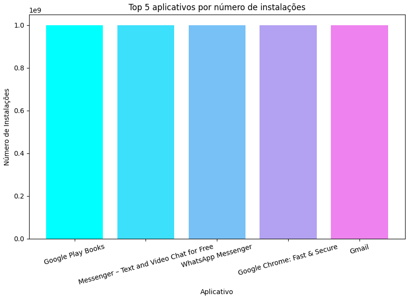
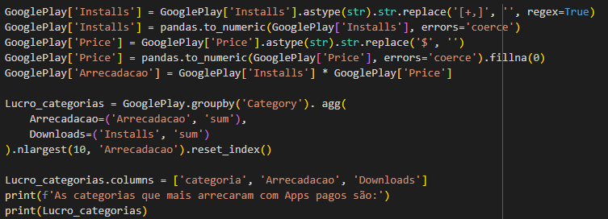
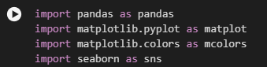

# Resumo

Nesta sprint pude conseguir mais uma certificação da AWS na qual me confere mais proeficiência ao lidar com a nuvem e serviços da AWS. Além de experiência e conhecimentos na linguagem Pyhton, tais como modelagem, limpeza, extração e manipulação de dados através puramente de linhas de códigos, os quais serão de importância para análise de dados no futuro, além de utilizar novamente a linguagem markdown para colocar comentários no Jupyter notebook que também tivemos contato durante o decorrer da sprint.

# Evidências
### Criação do primeiro gráfico: O espectro de cores usado, além da correta utilização de títulos, legendas e alinhamento das mesmas foram obervados como de importância durante esse processo. 

### Criação dos Códigos: No Python, diferente de algumas outras linguagens o uso de identação para definir a estrutura de execução do código é de suma importância e foi observado atentamente durante a escrita do mesmo. 

### Importar bibliotecas: O Python já vem com várias funções e ferramentas porém é bem comum fazer uso de bibliotecas de componentes em grande parte dos projetos desenvolvidos com essa linguagem, tais como o que usei que foram Pandas, Matplotlib e Seaborn. 

# __[Desafio](/Sprint_03/Desafio/)__

# __[Certificados](/Sprint_03/Certificados/)__
