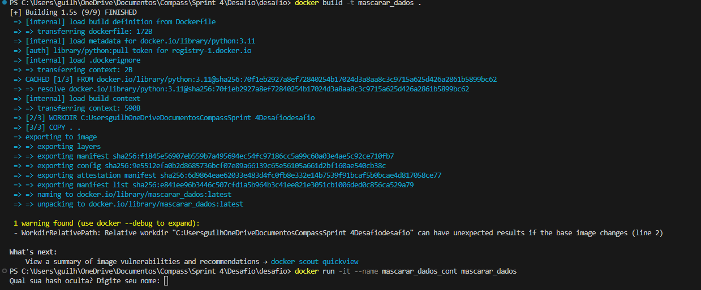
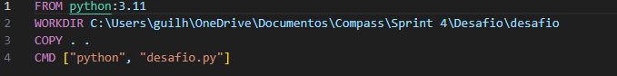
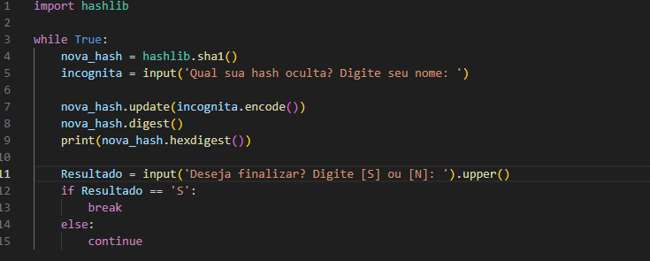

# Resumo

Durante a Sprint uma nova certificação da AWS foi adquirida além de mais conhecimentos sobre Python, início do contato com Docker e Estatística Descritiva, além de conhecimentos sobre Programação Funcional. Conhecimentos esses necessários para um bom Profissional de Dados. Após a Conclusão da sprint, assuntos principalmente como criação de containers, execução, reativação de desativação de container me são mais familiares e até mesmo a utilização de serviços de utilização de máquinas da AWS para trabalho em nuvem foram abordados.

# Evidências
### Criação de Containers: Durante a criação de containers é possível, para melhor administração das informações e containers em execução, nomear containers criados para responderem a nome mais fáceis de serem utilizados.

### Criação de Dockerfiles: Apesar de ser possível utilizar o docker diretamente pelo programa, ainda se é amplamento utilizado por terminal e uma parte fundamental em qualquer um dos casos é estruturar bem o que o container fará, tal como executar o python como o exemplificado. 

### Importar bibliotecas: O Python pode ser executado sem qualquer problema em containers docker, inclusive importando bibliotecas como no exemplo. 

# __[Desafio](/Sprint_04/Desafio/)__

# __[Certificados](/Sprint_04/Certificados/)__
