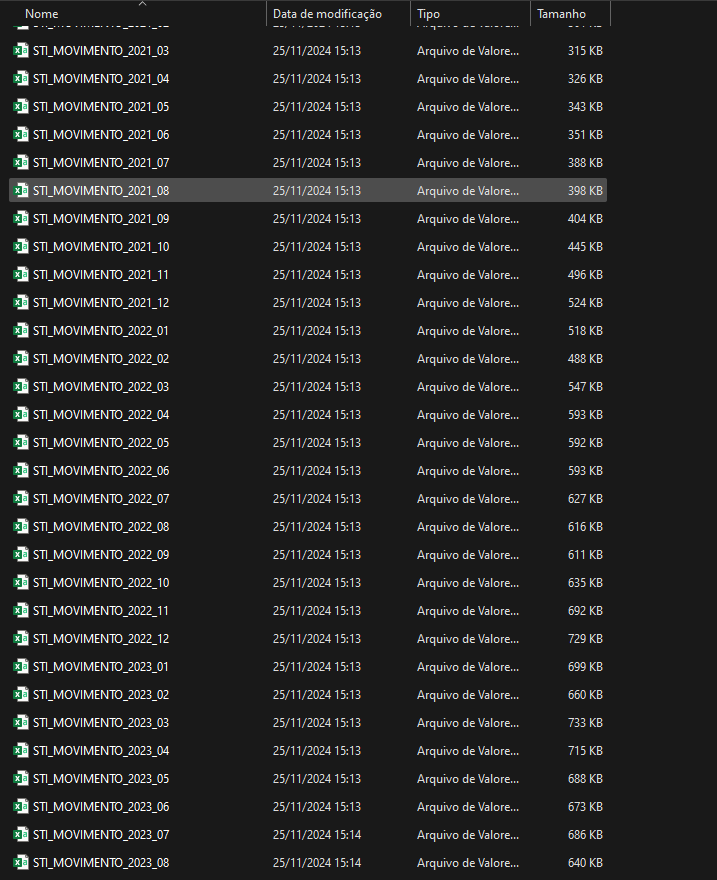
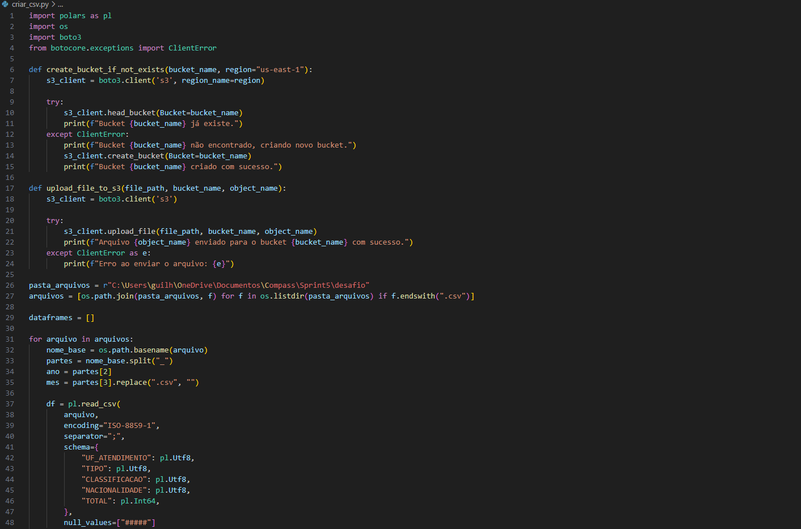
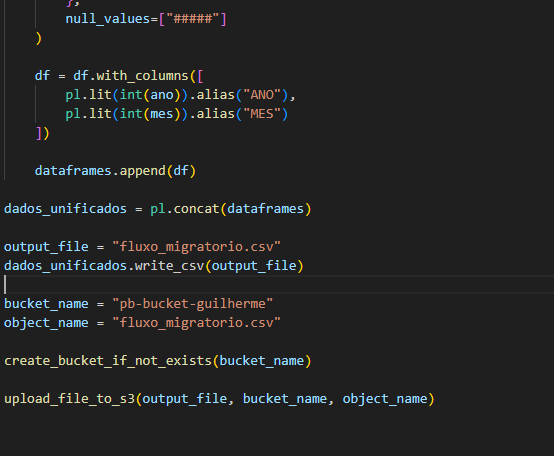
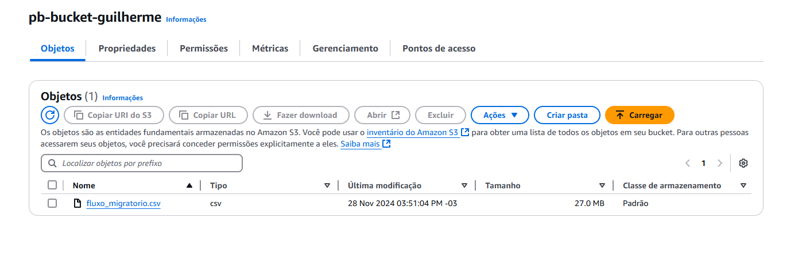
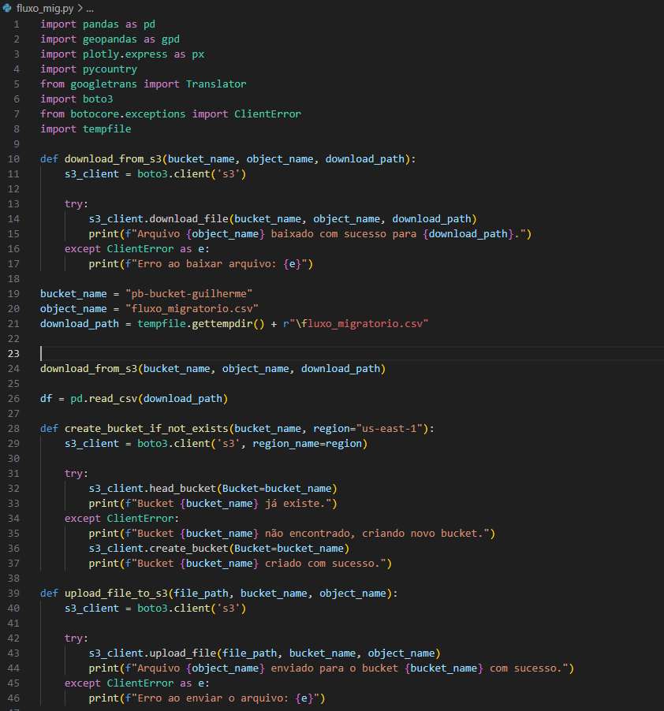
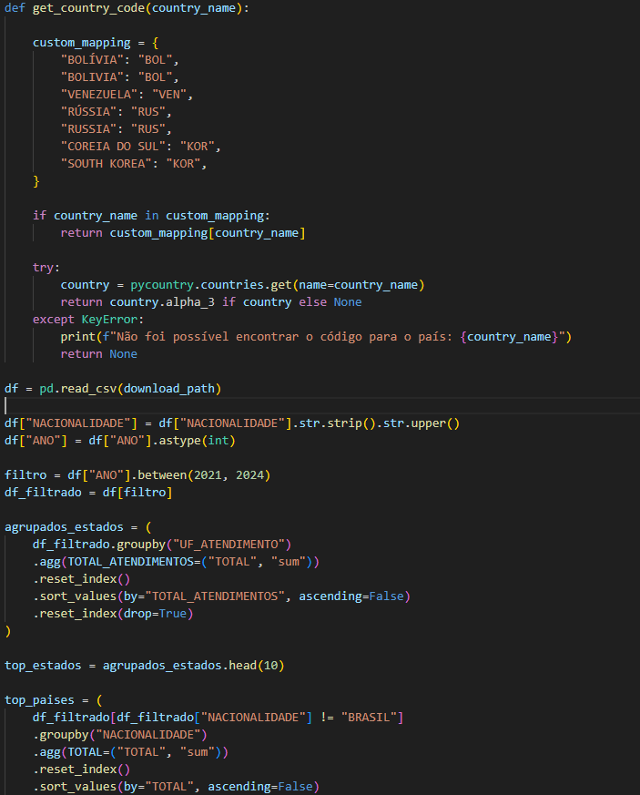
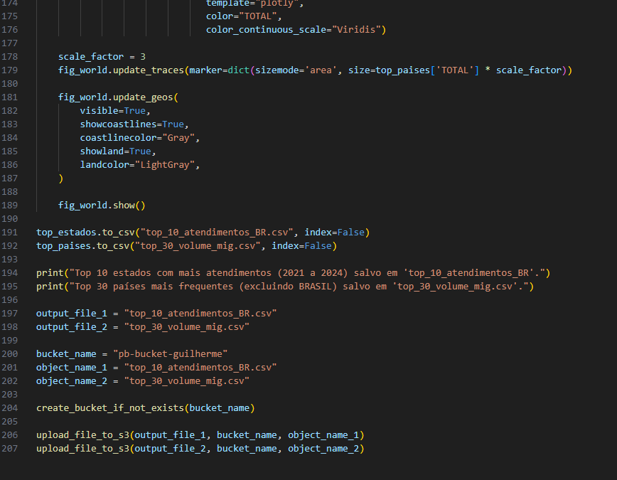
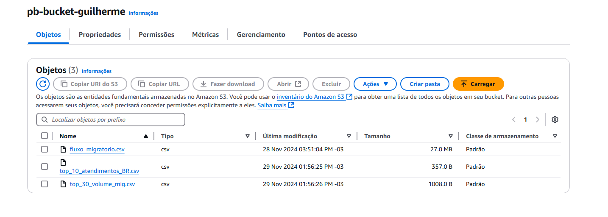
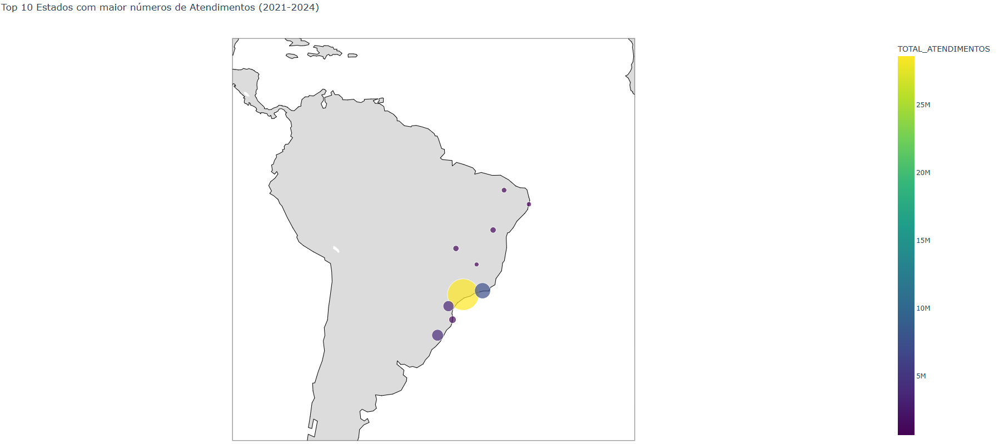
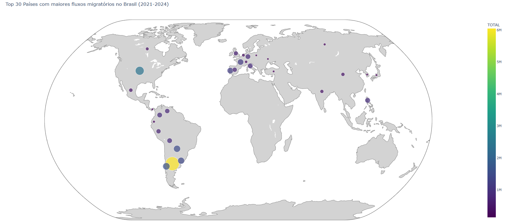

# Etapas
### 1. Junção de CSVs
  ##### Ao analisar o conjunto de dados escolhido percebi a necessidade de usar todos para uma maior oferta de dados temporais já que cada arquivo representava um mês iniciando em Janeiro de 2021 e indo até Outubro de 2024, o arquivo resultante recebey o nome de fluxo_migratorio.CSV:

  ##### O código usado para tal é demonstrado abaixo já com a função de, além de juntar os arquivos em um só, já fazer o upload para o Bucket, o criando caso ainda não existisse, conforme solicitado no desafio: 
 
 
  ##### Após a execução do código a resposta obtida foi a seguinte: 
 
  ##### A seguir o resultado final após o upload do arquivo: 
 

### 2. Download de Arquivos e Manipulação
  ##### Após concluir a etapa anterior o próximo passo era criar um novo código que manipulasse o arquivo que foi feito upload anteriormente para gerar novos arquivos CSV que satisfizessem algumas condições de uso de funções específicas.
  ##### No início importei as bibliotecas que faria uso, defini a função da biblioteca boto3 que faria primeiramente o download do arquivo localizado no bucket, em seguida ler o arquivo e por fim aproveitei a função anteriormente usada para criar um novo bucket, que neste caso iria apenas o referenciar já que ele já havia sido criado em outro momento, a seguir o trecho de código citado:

  ##### Após concluir essa parte avancei para a criação da parte seguinte do código em que defini alguns códigos de países para otimizar a busca pelos paises, então evoquei a biblioteca pycountry que seria útil futuramente assim como a definição dos códigos de país. Na próxima seção para ter certeza que a coluna nacionalidade seria padrozinada em letras maiusculas. Um dos motivos de se juntar os arquivos CSV em apenas um era que eles possuiam como nome a data e mês que faziam referência, mas não traziam nos dados essa informação, após resolver esse problema pude aqui transformar a informação de ano em tipo int e depois filtrar informaçãos pelo ano entre 2021 e 2024. Agrupei as UF de atendimento e usei a função de soma para registrar a quantidade de atendimento por unidades. A amostra desses dados foi definida para ser exibida as 10 primeiras entradas dos maiores números de atendimento, logo após segui para a segunda proposta, saindo da análise a nível nacional e chegando ao nível internacional.

  ##### A análise internacional foi feita com uma função igual a de estados porém dessa vez foram agrupados por nacionalidade excluindo o Brasil e novamente somei os resultados. Para ficar visualmente mais agradável o index foi ajustado. Um problema enfrentado foi que para minha próxima manipulação era necessário que os países fossem exibidos em Inglês, porém estavam em Portugês, então usei a biblioteca translator juntamente com uma função específica para transformar os nomes da coluna nacionalidade da lingua portuguesa para a inglesa. Especifiquei as coordenadas de todos os estados brasileiros que seriam usados na análise criei uma função para que a latitude e longitude dos 10 estados com mais atendimentos e então gerar um mapa do Brasil com as informações visuais do que será também exbido nos dados do CSV a ser gerado, as configurações de personalização focam o mapa no Brasil e definem outras opções como cor, escala dos marcadores, tamanho de textos, titulos entre outros.

  ##### Finalizado o mapa dos estados brasileiros, segui o mesmo processo para a criação de um mapa mundi com as informações dos 30 países com maiores fluxos migratórios em relação ao Brasil. Para a criação de ambos os mapas foi necessário o download de alguns arquivos que foram evidenciados com os caminhos referentes a cada um.

  ##### Dada a criação de ambos os mapas as informações que foram filtradas e utilizadas para eles foram utilizadas para criar dois arquivos CSV com os respetivos dados em formato de linhas e colunas, além das informações já nos arquivos CSV terem sido automaticamente arquivadas no serviço S3 da AWS, conforme solicitado.

  ##### Após a conclusão do script após a execução recebi mensagens de sucesso na exportação para a nuvem e que o bucket ja existia, não havendo necessidade de criar outro.

### 3. Conclusão
  ##### Ao final do processo o bucket se encontrou com 3 arquivos CSV, um sendo o banco de dados baixado no início da atividade e dois como resultado das manipulações propostas
 
  ##### Além disso dois mapas também foram criados para ilustrar as informações contidas em ambos os CSVs
 
 

### 7. Links Úteis
  #### [Certificados](/Sprint_5/Certificados) 
  #### [Evidencias](/Sprint_5/Evidencias)
  #### [Exercícios](/Sprint_5/Exercicios)
