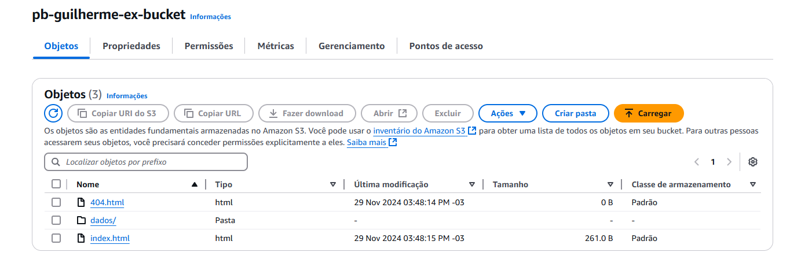
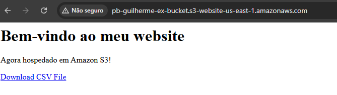
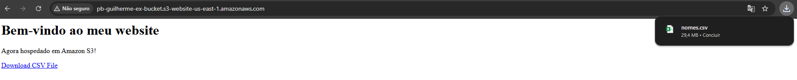

# Resumo

A Sprint 5 foi meu primeiro contato real com a AWS onde pude colocar em prática tudo o que aprendi até então. Houveram novos conceitos que foram adicionados através dos cursos propostos e os que ativamente fui em busca durante o desenvolvimento do desafio, o que se provou bastante prazeroso ao final durante a conclusão do mesmo. Fiz uso dos buckets na ferramenta S3 tanto para armazenar objetos quanto em um exercício trabalhando com sites estáticos inclusive com opção para download de arquivos!

# Evidências
### Criação de Buckets: Ao se criar um novo bucket no serviço S3 é importante se atentar ao nome, que precisa ser único no ambiente da AWS.

### Políticas: Para garantir o acesso aos dados é necessário se atentar às políticas dos buckets evitanto que problemas ao se conectar aos dados ocorram. 

### Download: Como conclusão é possível até mesmo fazer o download de arquivos diretamente de um link do seu S3 

# __[Desafio](/Sprint_05/Desafio/)__

# __[Certificados](/Sprint_05/Certificados/)__
