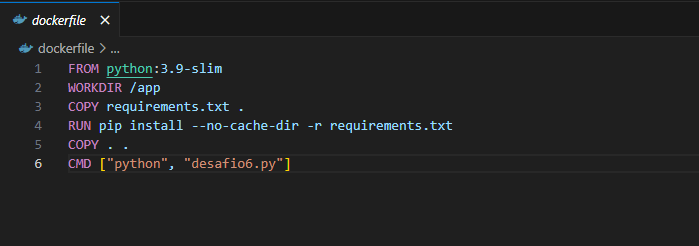
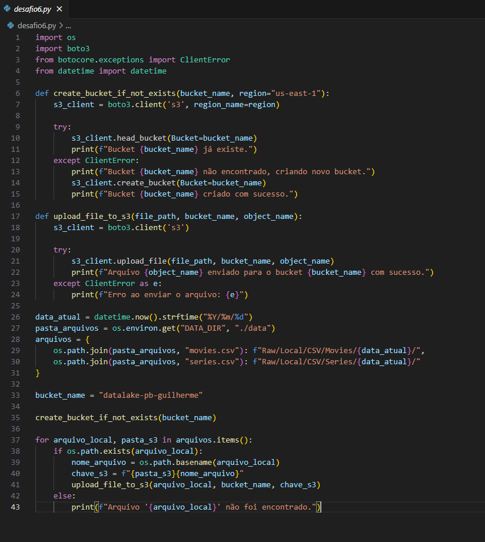
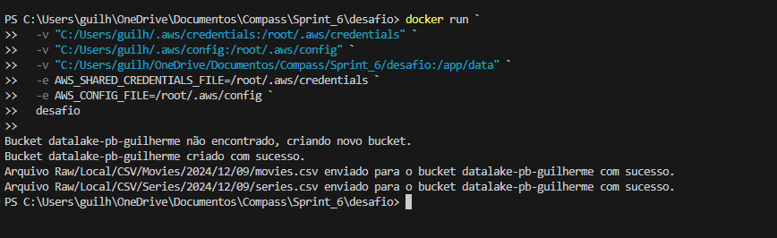
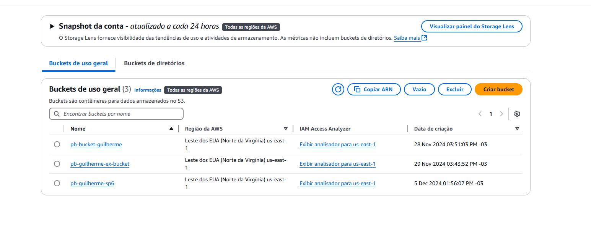
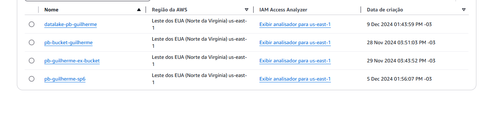

# Etapas
### 1. Definir perguntas a serem respondidas pela análise dos arquivos Movies.CSV e Series.CSV.
  ###### 1 - Análise de Sucesso de Filmes e Séries de Ação/Aventura com Foco nos Artistas Populares: Filmes e Séries com Artistas populares alcançam uma maior audiência e são melhor avaliados? Como a participação desses artistas afetam o desempenho do produto?
  ###### 2 - Filtrar por Ano e Análise de Tendências: Acompanhar a evolução de avaliações dos gêneros "Ação" e "Aventura" no decorrer dos anos. Houveram tempos em que um gênero foi mais popular que o outro? Isso se inverteu ou sempre caminharam juntos?
  ###### 3 - Análise de Preferência de Formato por Gênero: Algum desses dois gêneros tem um formato preferido? por exemplo, filme de "Ação" fazem mais sucesso que os de aventura? Isso se repete quando mudamos para o formato de séries ou o publico no geral tem um gosto diferente para cada formato de produção?
  ###### 4 - Conclusão sobre Preferências: Se compararmos tudo em um top 50 produções mais populares e de sucesso, filmes e séries dividem as colocações ou algum dos dois são favoritos em escolha do publico?

### 2. Criação do Arquivo Dockerfile
  ##### O desafio foi iniciado com o download do banco de dados que incluiam dois arquivos CSV, Movies e Series, após o download e descompactação era necessário efetuar o upload deles para um bucket e pasta no serviço S3 da AWS, para tal, um arquivo dockerfile foi desenvolvido.

  ##### Antes da execução foi necessário a criação do arquivo .py para as orientações ao sistema sobre como fazer o upload dos arquivos.

### 3. Criação do Código Python
  ##### Para o correto funcionamento do código as bibliocates os, boto3, botocore.exceptions e datetime foram necessárias. Após importar todas utilizei a mesma função que criei na sprint 5 denominada create_bucket_if_not_existis e upload_file_to_s3, sendo a primeira para criar o bucket necessário caso ele não existisse e a segunda para fazer o upload do arquivo. Ao fazer o upload do arquivo era necessário o acréscimo da data atual no caminho das pastas, fiz uso da biblioteca datetime durante esse processo para que a data no formato ano, mes e dia fossem acrescentada. Utilizando a biblioteca os fiz com que os arquivos movies.CSV e series.CSV fossem buscados em meu computador pelo nome e em seguida defini o caminho ao qual seriam adicionados incluindo a função datetime desenvolvida anteriormente. Defini o nome do bucket e evoquei a função create_bucket_if_not_exists e para finalizar uma função que utilizaria do nome do arquivo que foi buscado anteriormente e da função upload_file_to_s3 para finalizar o processo.

### 4. Execução do Container Docker
  ##### Após criados os dois códigos tanto do python quanto do docker pude executá-los. Primeiramente executei o comando Docker Build para criar a imagem e depois Docker run para rodar meu container, foi necessário algumas instruções extras para a execução do container. Criei volumes para a pasta desafio que é onde se localizavam meus arquivos CSV que seriam subidos para a nuvem e criei volumes paras os arquivos credentials e config também que são onde se encontram conteudo sensível da AWS como códigos de acesso e configurações do ambiente assim não sendo necessário o upload desses dados para o container.

  
### 3. Conclusão
  ##### Ao final do processo podemos contatar o antes e depois do AWS S3 confirmando a criação do novo bucket e upload dos arquivos.
 
 

### 7. Links Úteis
  #### [Certificados](/Sprint_6/Certificados) 
  #### [Evidencias](/Sprint_6/Evidencias)
  #### [Exercícios](/Sprint_6/Exercicios)

