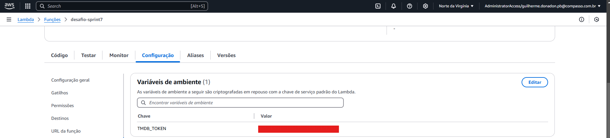
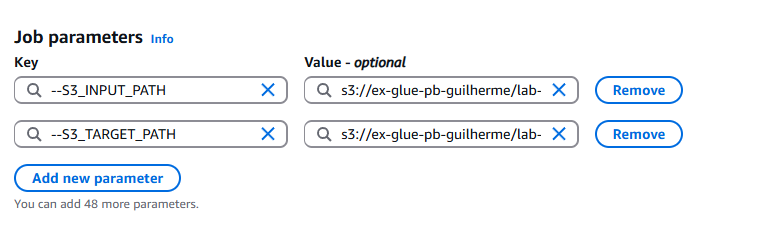

# Resumo

A Sprint 7 foi o contato inicial que tivemos com algumas ferramentas e métodos. Dentro elas a utilização de APIs, nesse caso a do TMDB, aprendemos a como fazer a requisição e complementar informações que já temos ou obter outras totalmente novas. ALém disso tivemos acesso ao AWS Glue e pudemos experimentar a ferramenta e conhecer melhor seus usos e aplicações, além de novamente poder utilizar a AWS Lambda para fazer nossas requisições de API.

# Evidências
### Ao utilizar AWS Lambda, chaves de acesso e senhas não precisam estar inseridas diretamente no código, em vez disso podem ser configuradas como variáveis de ambiente.

### Assim como pode ser feito ao utilizar AWS Glue, nesse caso chamado de parâmetros, podem ser usados inclusive para indicar caminhos onde determinado arquivo se encontra ou onde deve ser gerado o arquivo resultante da atividade.

# __[Desafio](/Sprint_7/Desafio/)__

# __[Certificados](/Sprint_7/Certificados/)__
