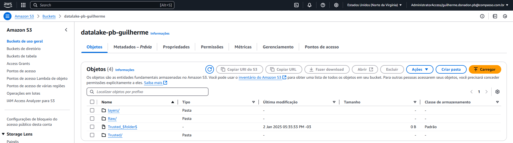

# Etapas
### 1. Configuração Inicial
  ##### As configurações iniciais foram definir a versão do Glue, as permissões do IAM, a linguagem a ser utilizada o Worker Type e o numero de Workers, além do tempo a ser reservado para a execução do job, como mostrado em alguns exemplos a seguir!

### 2. Criação dos scripts
  ##### Foram criados dois scripts diferentes, um para cada job, sendo o primeiro focado em trabalhar com os arquivos CSV. O script foi responsável por iniciar a sessão Park, localizar e ler os arquivos CSV mediante o caminho so s3 fornecido, definir o tipo de esquema e separador usado nos CSVs além de fazer um leve tratamento para valores nulos em ambos os arquivos. Após isso foram transformados em formato .parquet e salvos novamente no bucket porém dessa vez na camada Trusted.

  ##### O segundo script tratou os arquivos em formato .json, inicialmente se fez o processe de iniciar a sessão Spark e então a definição do esquema foi um pouco mais detalhada por conter dados de diferentes formatos dentro do mesmo arquivo Json, logo depois os jsons foram lidos no caminho informado e um tratamento para preencher colunas com valores nulos ou criar esses campos e preenche-los com o tratamento correto também foi realizado, assim como anteriormente nos arquivos CSVs o arquivo foi convertido para formato .parquet e então salvo também no bucket s3 na camada Trusted

### 3. Resultados dos Buckets
  ##### Como resultado da execução dos scripts acima a camada Trusted foi criada conforme imagem a seguir

  ##### Após a criação da camada Trusted os arquivos foram organizados da maneira que se segue:

### 4. Resultados do Job 1
  ##### O job foi executado e foi exibida a notificação do sucesso da execução

  ##### Foi observado a criação correta dos arquivos no bucket s3 para os arquivos do CSV chamado Movies.

  ##### O mesmo se repetiu para Series

### 5. Resultados do Job 2
  ##### Assim como no Job 1, no Job 2 a flag de sucesso foi exibida.

  ##### Nos Jsons referentes aos filmes também foram realizadas as gravações de arquivos.

  ##### E em Series também

### 6. Links Úteis
  #### [Certificados](/Sprint_08/Certificados) 
  #### [Evidencias](/Sprint_08/Evidencias)
  #### [Exercícios](/Sprint_08/Exercicios)
