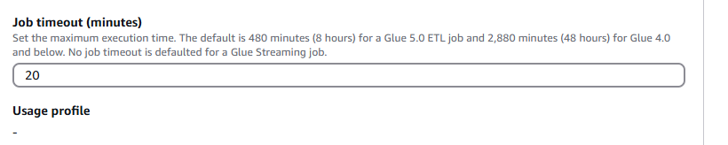
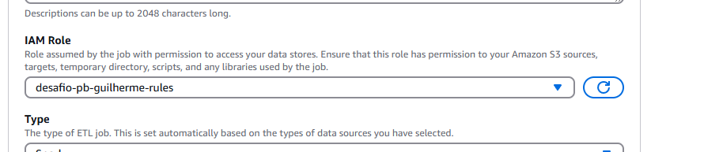

# Resumo

Ao decorrer da Sprint 8 pudemos aprimorar as habilidades no uso da ferramenta AWS Glue no qual a utilizamos para transformar e copiar dados de maneira rápida, segura e otimizada já adequando aos padrões necessários para serem inseridos à camada de dados confiaveis em nosso DataLake.

# Evidências
### Quando usando o AWS Glue, uma confiuração de grande importância é o tempo de execução de seu Job para assim garantir que não será encerrado antecipadamente durante a execução de seu script

### Além do mencionado anteriormente, a correta configurações de rules no AWS IAM garante que você terá todas as permissões necessárias para executar seu Job sem nenhum imprevisto.

# __[Desafio](/Sprint_08/Desafio/)__

# __[Certificados](/Sprint_08/Certificados/)__
