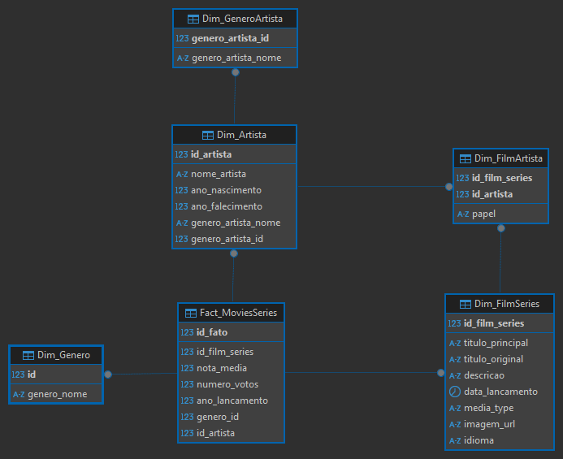

# Resumo

Na Sprint 9 o foco foi em seguir trabalhando com os arquivos que já tínhamos, dessa vez, porém, tratando, limpando e moldando a fim de se adequar à necessidade de uso no AWS QuickSight. Tivemos um maior contato com o AWS Glue e pudemos desenvolver nosso código Spark para criarmos nosso modelo multidimensional e as tabelas no Glue Catalog, tudo para a preparação para a exibição e visualização de nossos dados e a possibilidade de responder as perguntas que apresentamos na sprint 6.

# Evidências
### Ao trabalhar com uma volume de dados mais robusto, uma visualização pode nos ajudar e nos direcionar e entender o que fizemos de certo e o que precisamos melhorar.

### Ao se preparar para trabalhar com a visualização de dados, uma parte importante é se atentar a criação das tabelas no Glue Catalog.
#### Crawler

#### Tabelas no Glue Catalog

# __[Desafio](/Sprint_09/Desafio/)__

# __[Certificados](/Sprint_09/Certificados/)__
