# Etapas
### 1. Ingestão de Dados no AWS QuickSight
  ##### Após os processos realizados nas Sprints anteriores os datas frames agora já estavam preparados para que o Athena pudesse lê-los e então o utilizei para fazer a ingestão dos dados necessários. O método consiste em selecionar o Athena como meio de ligação, selecionar o banco de dados e a partir daí selecionar as tabelas que se deseja acidionar ao QuickSight.
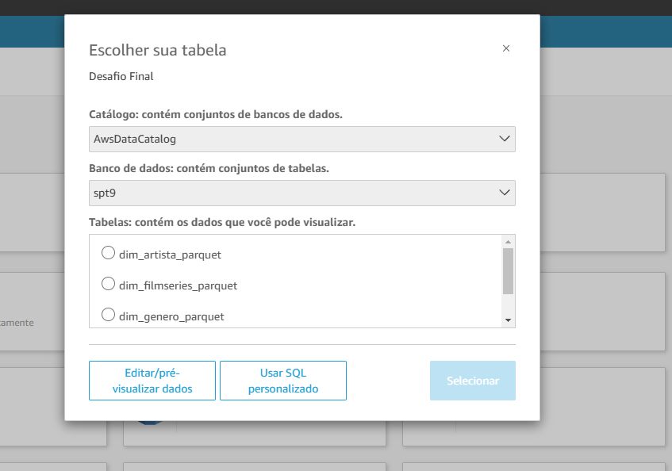
### 2. Configuração dos Dados
  ##### Após realizada a ingestão de todos os dados, ao acessar a tela de conjuntos de dados a seguinte imagem foi exibida
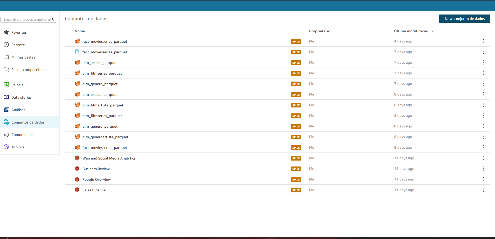
  ##### Selecionei então minha tabela fato e ao clicar em Editar Dados pude adicionar para meu conjunto os outros dataframes que havia adicionado anteriormente, o processo era de somente arrastar para ligar as tabelas nas posições corretas e então uma ligação entre as tabelas foi exibida, após conferir que estava tudo correto o próximo passo foi de especificar qual seria o tipo correto de join a ser utilizado. Finalizado o processo de selecionar quais tabelas seriam ligadas, os campos que serviriam de chave primária e extrangeira e o tipo de join a ser utilizado o resultado obtido foi:
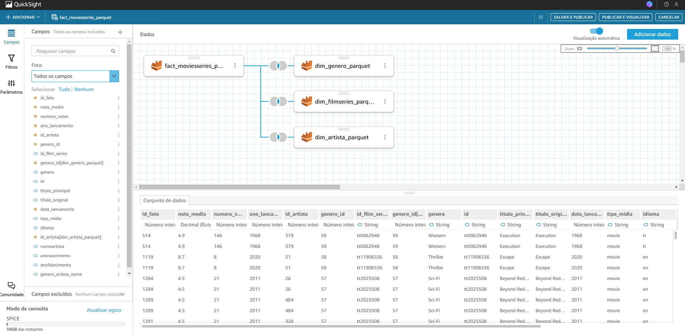  
  ##### Quando encerrei todos os passos anteriores, na aba "Análises" um novo card foi exibido já com meus dados preparados para se iniciar a criação do Dashboard.
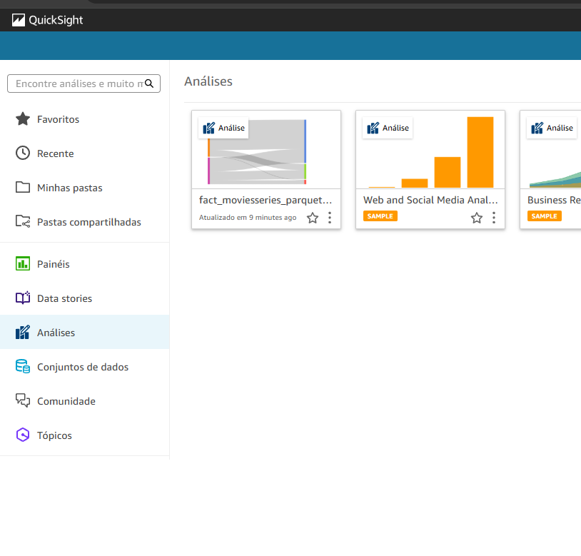
### 3. Criação de Gráficos, Filtros e Ações
  ##### O primeiro passo para se iniciar a criação do Dashboard foi recapiular as perguntas feitas durante a Sprint 6 para garantir que todas seriam respondidas apropriadamente:
  ###### 1 - Análise de Sucesso de Filmes e Séries de Ação/Aventura: Filmes e Séries de Ação ou Aventura são mais lançados? O número de produções dos gêneros são semelhantes ou há prevalência de algum?
  ###### 2 - Filtrar por Ano e Análise de Tendências: Acompanhar a evolução de avaliações dos gêneros "Ação" e "Aventura" no decorrer dos anos. Houveram tempos em que um gênero foi mais popular que o outro? Isso se inverteu ou sempre caminharam juntos?
  ###### 3 - Análise de Preferência de Formato por Gênero: Algum desses dois gêneros tem um formato preferido? por exemplo, filme de "Ação" fazem mais sucesso que os de aventura? Isso se repete quando mudamos para o formato de séries ou o publico no geral tem um gosto diferente para cada formato de produção?
  ###### 4 - Conclusão sobre Preferências: Se compararmos tudo em um top 20 produções mais populares e de sucesso, filmes e séries dividem as colocações ou algum dos dois são favoritos em escolha do publico?
  ##### Foram Criados dois filtros que afetam o Dashboard completo, um para que somente os gêneros de "Ação, Aventura ou Ação e Aventura"(sendo a junção dos dois gêneros tratado como uma métrica também) fossem exibidos e um outro filtro para que pudéssemos escolher se veríamos apenas filmes, séries ou ambos, conforme será exibido posteriormente.
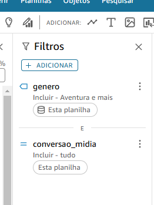
  ##### Para a criação dos gráficos corretamente alguns campos extras eram necessários, para isso utilizei da funcionalidade de criação de Campo Calculado, o qual criei alguns campos extras como "Alta Participação" que definia uma métrica para gêneros com alta aparição em determinados dados, "ano em string" para melhor trabalhar com anos e padronizar a exibição do mesmo, e "conversao_midia" para consertar o nome dos tipos de midia e melhorar sua exibição, dentre outros.
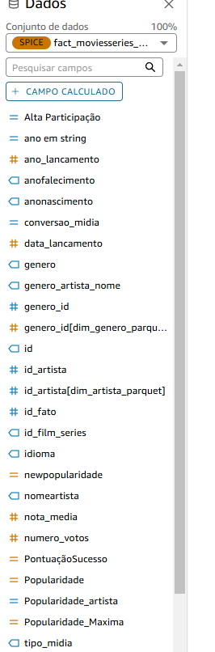
  ##### Após a criação dos gráficos, observei que o de linhas poderia ser usado para filtrar dados de gênero em outros gráficos, então criei uma ação atralada a ele para essa função.
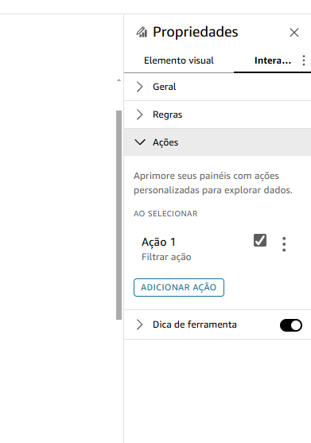
### 4. Publicação do Dashboard
  ##### Após a finalização do Dashboard fiz a publicação do mesmo sendo criado na aba "Painéis" um cartão com o resultado de todo o trabalho concluído.
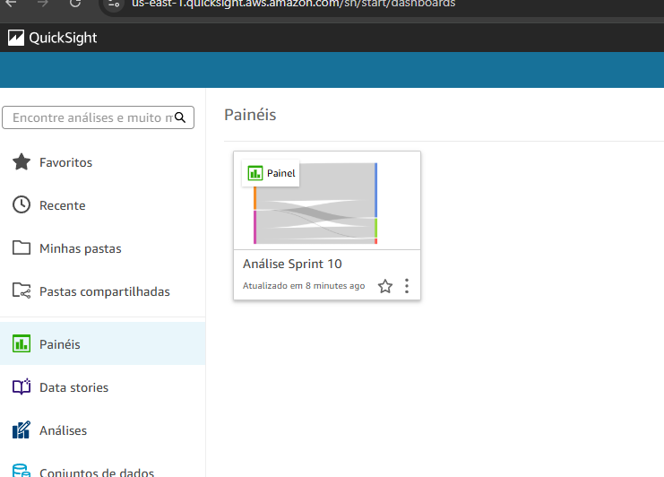
### 5. Resultados Finais
  ##### Ao terminar todo o projeto criei 4 iamgens com os resultados e execução dos filtros para melhor observá-los em execução
  ##### 1 - Todos os dados aqui são exibidos mostrando o dashboard em seu estado mais completo com as análises em sua complecidade sobre Filmes, Séries e também os Gêneros Analisados.
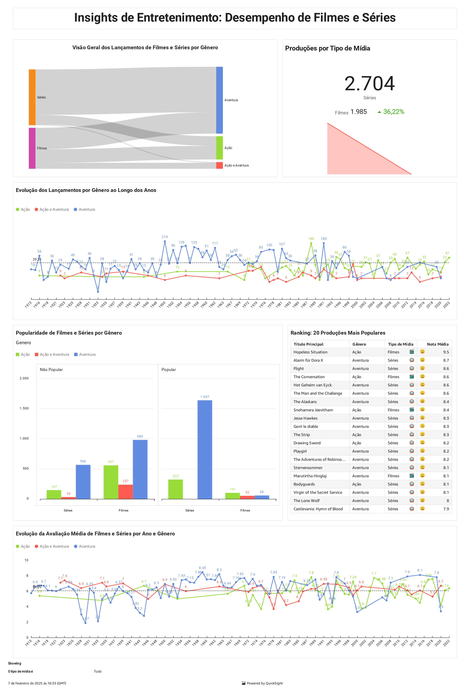
  ##### 2 - Para o Dashboard de Séries todas as informações foram filtradas para exibir gráficos, valores e informações a respeito somente sobre Séries, excluindo as informações de Filmes.
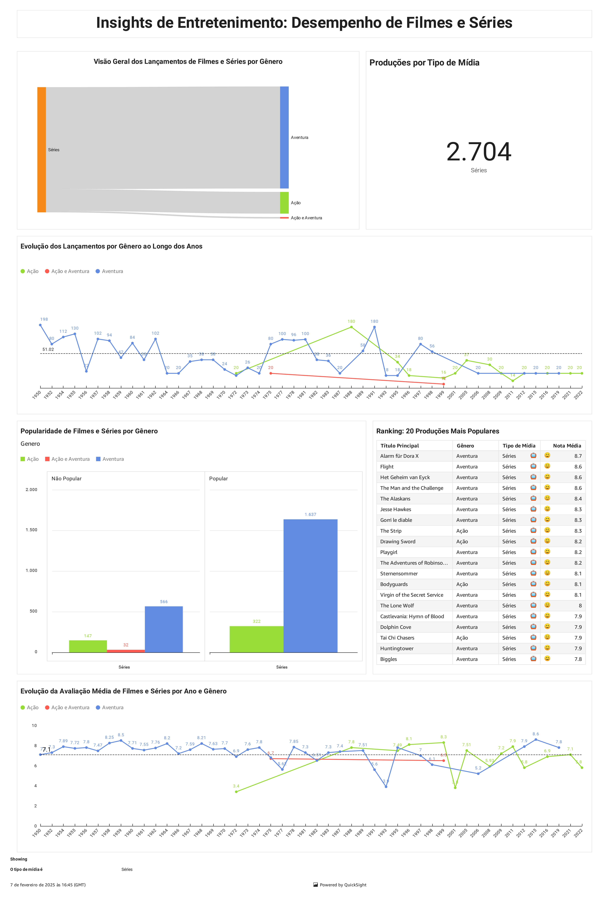
  ##### 3 - O Dashboard de Filmes funciona da mesma maneira porém dessa vez exibindo as informações sobre Filmes e ocultando as de Séries
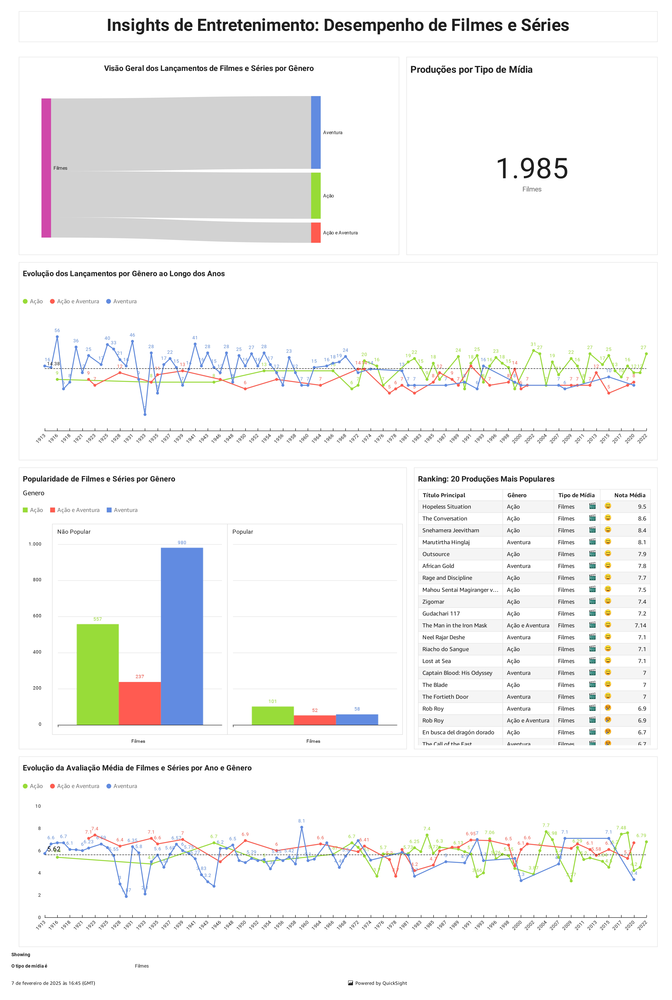
  ##### 4 - A Seguir o filtro foi realizado pela ação de gráfico, filtrando as correspondências de gêneros e ano, então aqui exibindo um exemplo somente com informações sobre o gênero e ano selecionados.
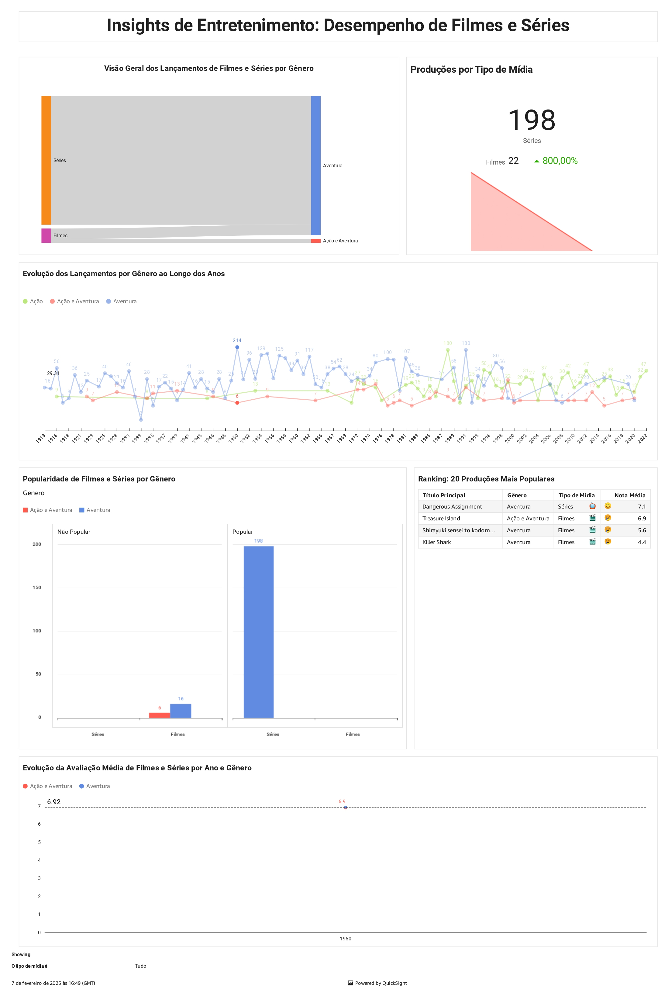

### 6. Links Úteis
  #### [Certificados](/Sprint_10/Certificados) 
  #### [Evidencias](/Sprint_10/Evidencias)
  #### [Exercícios](/Sprint_10/Exercicios)
