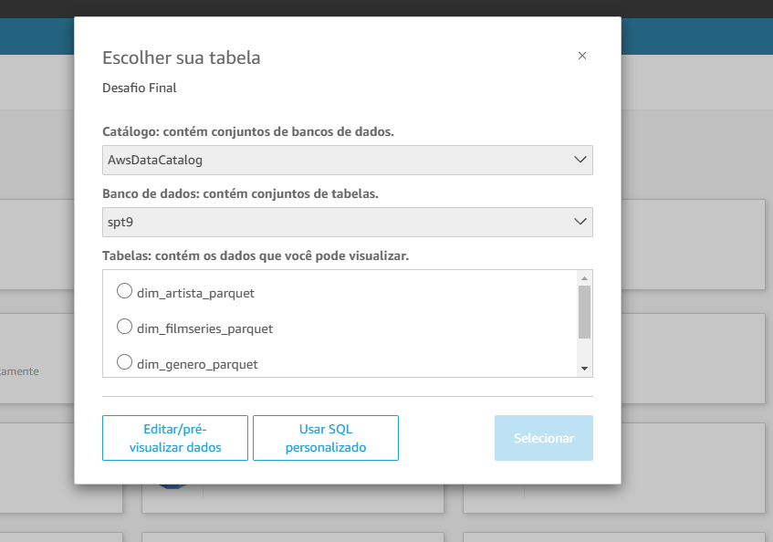
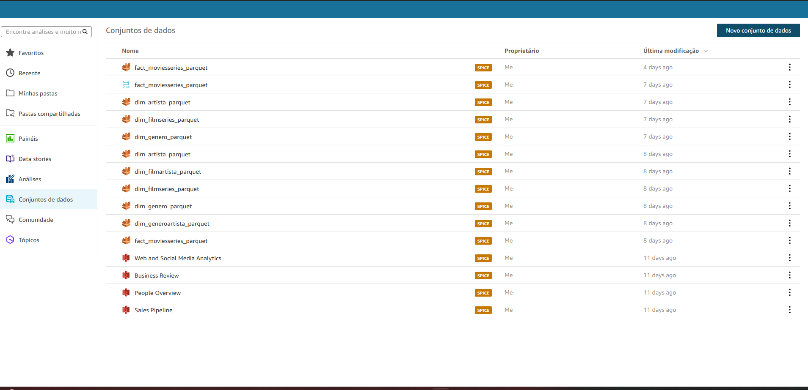
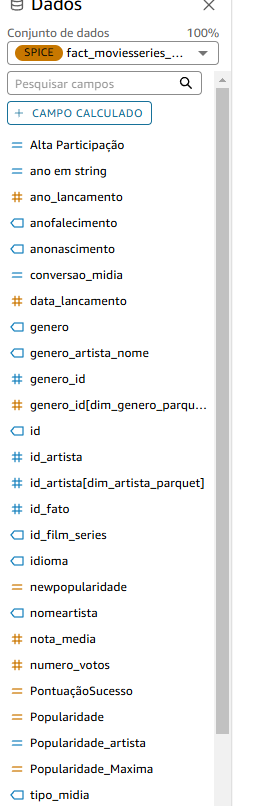
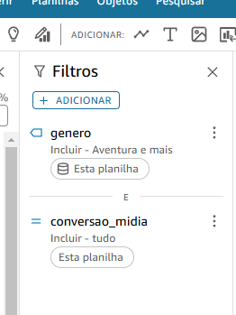

# Resumo

Rumamos à última Sprint e o desafio iniciado durante a Sprint 6 também se finda, tendo aqui a finalização de todo o trabalho unimos desde a criação das perguntas que pensaríamos em responder, então passamos pela fase de ingestão de dados provindo tanto do arquivo CSV fornecido pela Compass quanto das requisições que fizemos ao TMDB com o trabalho feito através da API utilizando o AWS Lambda. Seguindo após isso foi a fase de limpeza e transformação dos dados nos quais utilizando o AWS Glue trabalhar com os dados e então movê-los das camadas Raw para a Trusted já os transformando em formato Parquet para otimização de leitura no AWS Athena o qual utilizaríamos na Sprint 10. 
Então para finalizar o processo utilizamos novamente o AWS Glue para a criação de nossos DataFrames que seriam usados para a montagem do Dashboard, o processo foi concluído com a utilização do Crawler para criação das tabelas que utilizamos enfim no AWS QuickSight.

# Evidências
### Ingestão de Dados QuickSight

#### Configuração

#### Filtros e Extras

# __[Desafio](/Sprint_10/Desafio/)__

# __[Certificados](/Sprint_10/Certificados/)__
