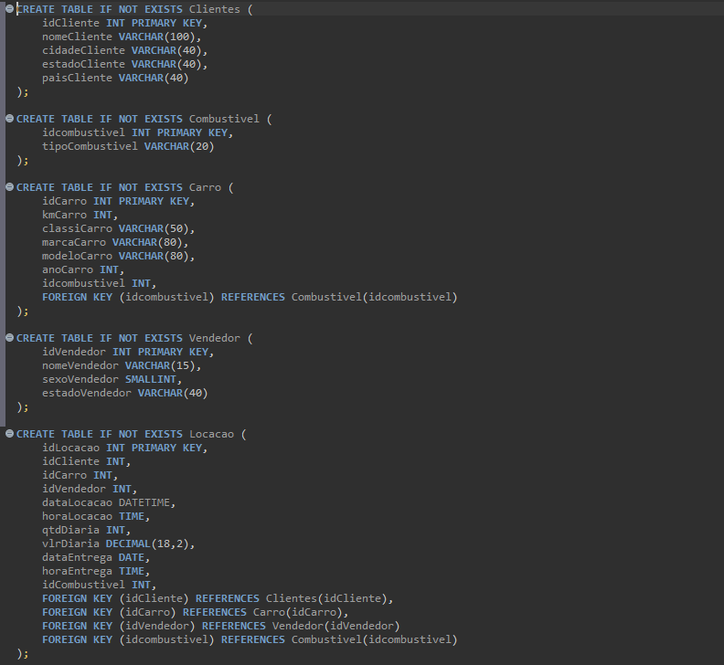
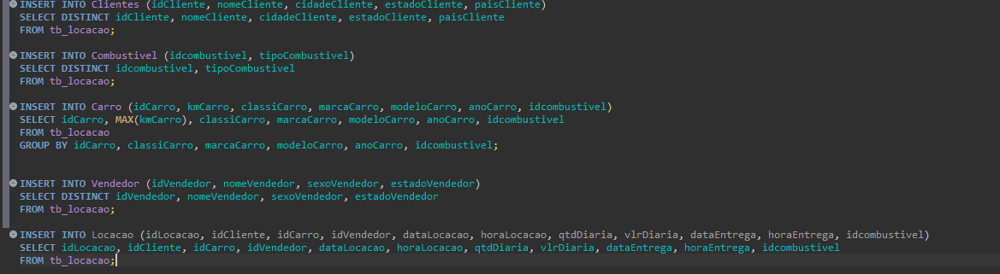
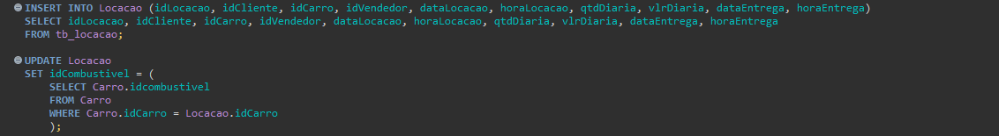
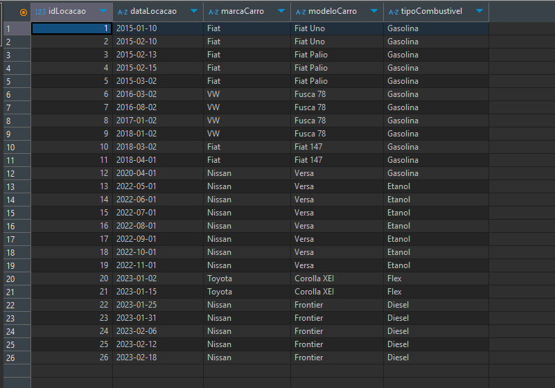

# Resumo

Na Sprint 2 pude aprender mais sobre SQL, no curso me foi apresentado o interpretador para o PostgreSQL e durante os exercícios utilizei o SQLlite, cada qual com suas particularidades, porém, no âmbito geral pude adquirir um conhecimento valioso, já havia tido contato anteriormente com SQL mas somente de maneira bem básica para consultas simples, tive a experiência agora de aprender como fazer consultas mais complexas, além de adições, alterações e exclusões de dados de tabelas e banco de dados. Finalizei os exercícios propostos com um conhecimento imensamente maior do que ao iniciar a Sprint. 
Aprendi também sobre a normalização de banco de dados para evitar que dados inconsistentes, sejam eles duplicados ou nulos por exemplo, sejam enviados aos dados organizados e limpos ao final do exercício.
No curso da AWS aprendi sobre a nuvem, técnicas de vendas e retóricas à objeções, além de aprender mais sobre os produtos ofertados pela mesma.

# Evidências
### Criação das Tabelas: Durante a criação das tabelas é importante se atentar à criação de chaves primárias e extrangeiras dependendo da necessidade e função de cada tabela em si. Além disso a criação das colunas necessárias e de mandeira organizada ajuda durante a fase de inserção dos dados. 

### Inserção de Dados: Na fase de inserção dos dados nas tabelas criadas anteriormente é importante se atentar às colunas de onde serão pegos os dados e para onde serão enviados para não haver erros, além  disso dobrar a atenção em casos aos quais os comandos se diferenciam por alguma necessidade especifíca. 

### Correção idCombustivel: Para que não houvesse a duplicação da ligação da chave primária da tabela Combustivel o metodo de inserção teve que ser diferenciado, o qual falarei mais no README especifíco do desafio. 

### Ajuste de Datas: durante a criação das views as datas apareceram no programa DBeaver em formatos incorretos, por exemplo a data 2015/01/10 foi exibida como 20.150.110, para a correta exibição das informações o comando explicitado foi-se feito necessário. 

### View Locações: aqui se exibe um arranjo de dados em View para comprovar a correta alocação e exibição dos dados. 

# __[Desafio](/desafio/)__
