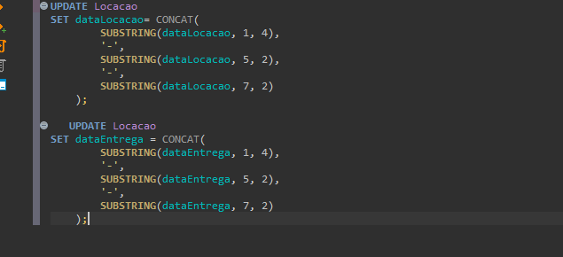

# Resumo

Na Sprint 2 pude aprender mais sobre SQL, no curso me foi apresentado o interpretador para o PostgreSQL e durante os exercícios utilizei o SQLlite, cada qual com suas particularidades, porém, no âmbito geral pude adquirir um conhecimento valioso, já havia tido contato anteriormente com SQL mas somente de maneira bem básica para consultas simples, tive a experiência agora de aprender como fazer consultas mais complexas, além de adições, alterações e exclusões de dados de tabelas e banco de dados. Finalizei os exercícios propostos com um conhecimento imensamente maior do que ao iniciar a Sprint. 
Aprendi também sobre a normalização de banco de dados para evitar que dados inconsistentes, sejam eles duplicados ou nulos por exemplo, sejam enviados aos dados organizados e limpos ao final do exercício.
No curso da AWS aprendi sobre a nuvem, técnicas de vendas e retóricas à objeções, além de aprender mais sobre os produtos ofertados pela mesma.

# Evidências
### 

# __[Desafio](/desafio/)__
