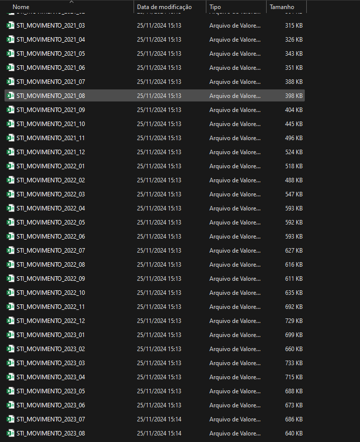
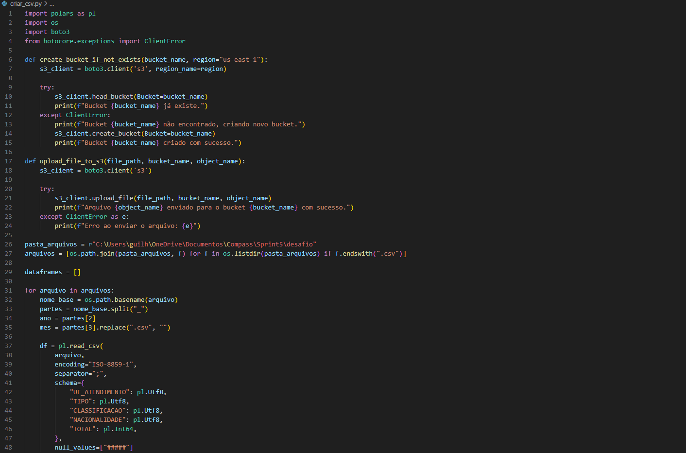
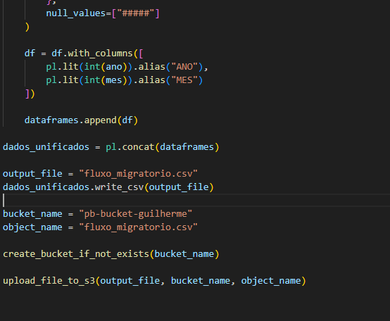
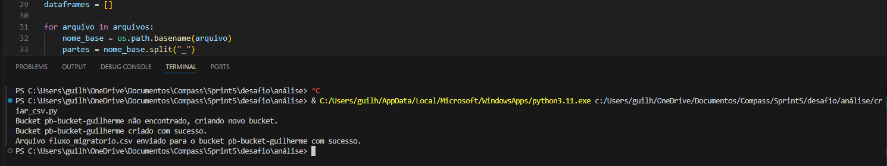
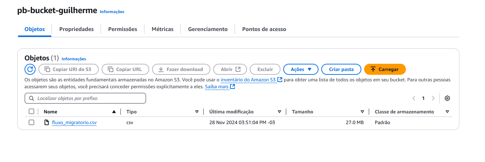

# Etapas
### 1. Junção de CSVs
  ##### Ao analisar o conjunto de dados escolhido percebi a necessidade de usar todos para uma maior oferta de dados temporais já que cada arquivo representava um mês iniciando em Janeiro de 2021 e indo até Outubro de 2024, o arquivo resultante recebey o nome de fluxo_migratorio.CSV:

  ##### O código usado para tal é demonstrado abaixo já com a função de, além de juntar os arquivos em um só, já fazer o upload para o Bucket, o criando caso ainda não existisse, conforme solicitado no desafio: 
 
 
  ##### Após a execução do código a resposta obtida foi a seguinte: 
 
  ##### A seguir o resultado final após o upload do arquivo: 
 

### 2. Download de Arquivos e Manipulação
  ##### Após concluir a etapa anterior o próximo passo era criar um novo código que manipulasse:

### 3. Criação do container com Hash
  ##### O primeiro passo foi a criação do código python que utilizaria a biblioteca Hashlib para com um input, neste caso optei por nomes, gerar um output com o código hash da informação inserida:
 
  ##### Assim como anteriormente um arquivo dockerfile foi criado e as configurações foram quase as mesmas da etapa 1 exceto pela mudança do nome do arquivo .py a ser executado: 
 
  ##### O container foi criado utilizando o argumento *-t* para renomear o container e durante a execução o argumento *-it* foi usado para que o container fosse executado em modo interativo com um terminal para que comandos possam ser executados em tempo real.
 
  ##### Após a correta execução dos comandos e script .py observei o resultado:
 

### 7. Links Úteis
  #### [Certificados](/Sprint_5/Certificados) 
  #### [Evidencias](/Sprint_5/Evidencias)
  #### [Exercícios](/Sprint_5/Exercicios)
