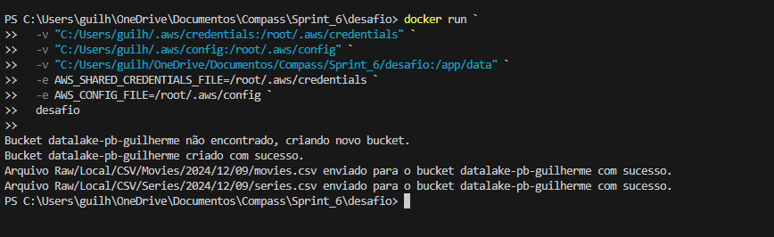
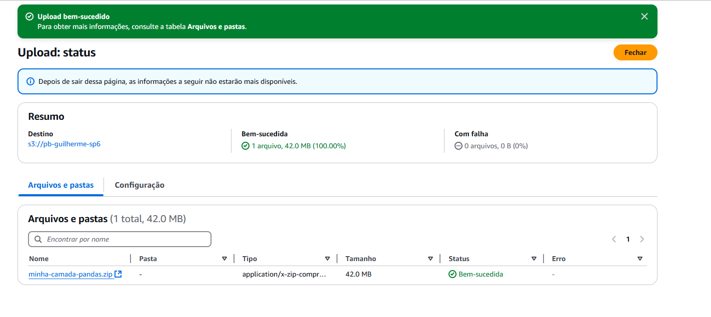
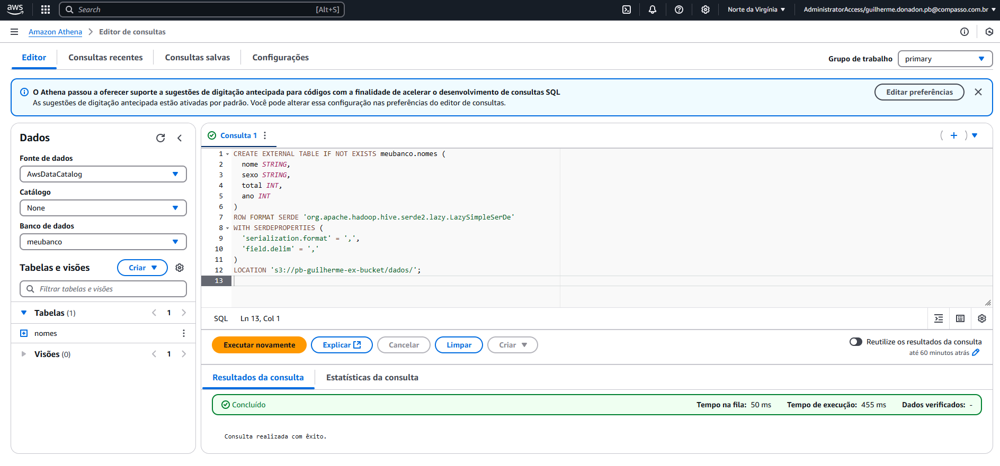

# Resumo

Durante a Sprint 6 tive um maior contato com ferramentas da AWS com AWS Lambda e AWS Athena no qual aprendi como criar camadas e entendi sobre como organizar meus arquivos para fazer uma query. Além disso, anteriormente utilizei um código Python para fazer upload de arquivos para o serviço S3, agora o upload foi feito diretamente de um container Docker o que expande ainda mais meus conceitos sobre como utilizar os serviços oferecidos.

# Evidências
### É possível fazer o upload de arquivos para o S3 utilizando códigos python e Docker..

### AWS Lambda: Bibliotecas como Pandas podem ser adicionadas ao fazer o upload a uma das camadas da AWS Lambda.

### AWS Athena: Caso já possua um arquivo CSV em seu bucket S3, é possível utilizá-lo para queries no AWS Athena. 

# __[Desafio](/Sprint_6/Desafio/)__

# __[Certificados](/Sprint_6/Certificados/)__
