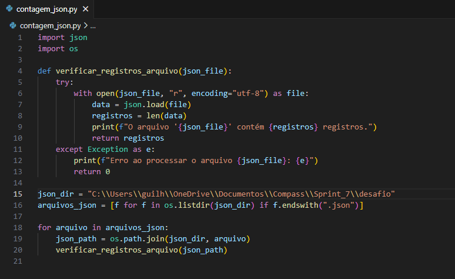
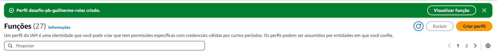
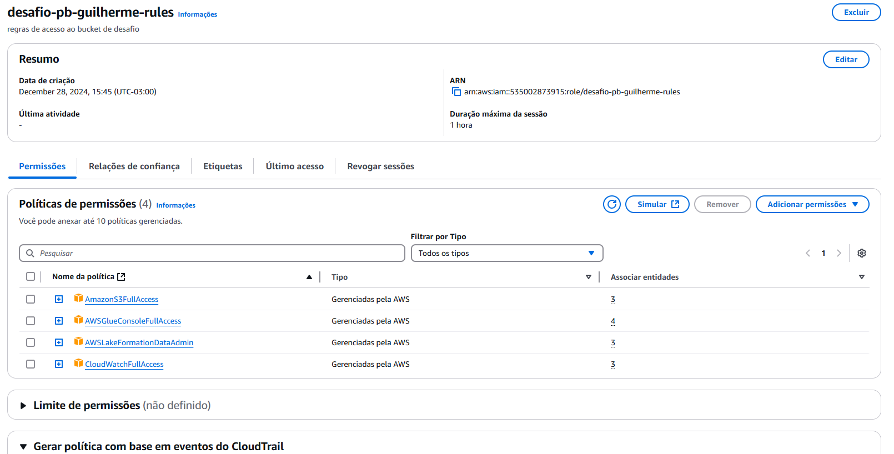
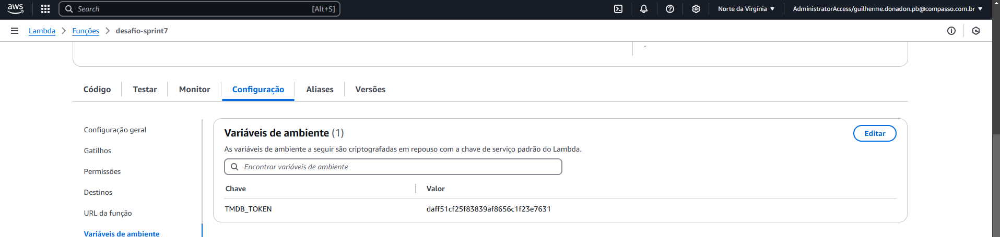
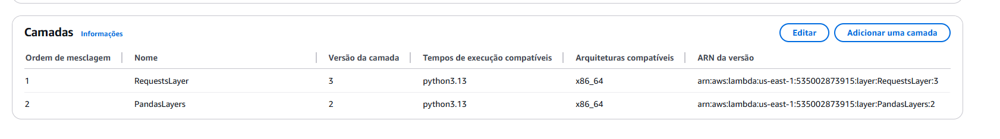
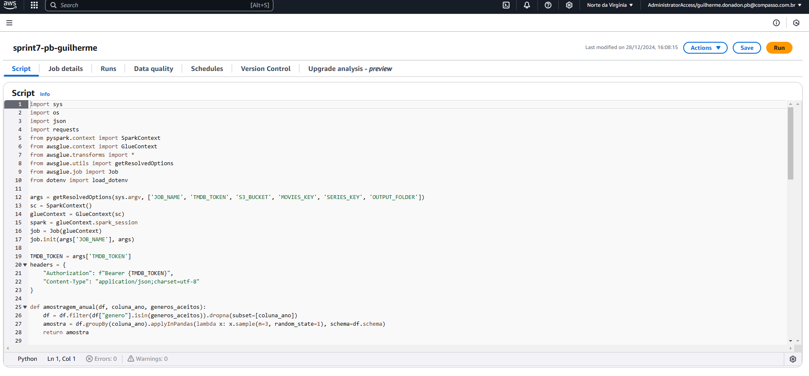
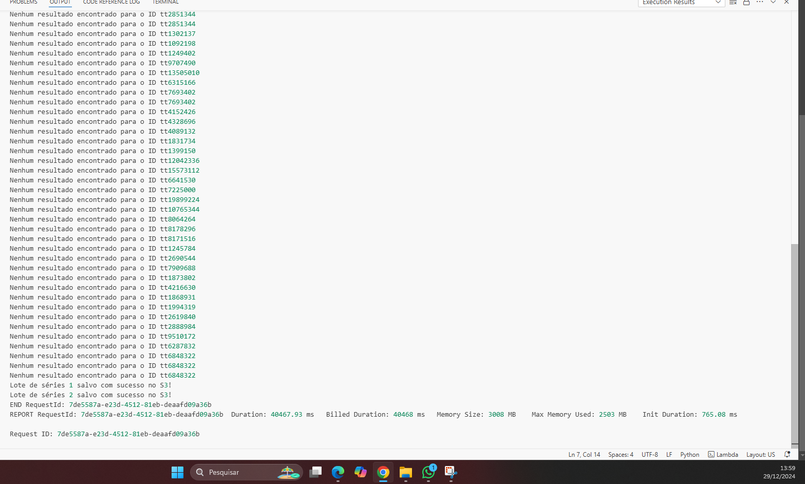
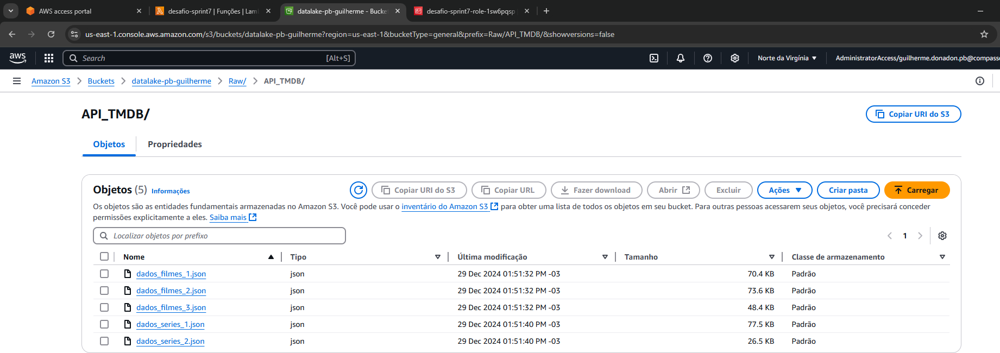

# Etapas
### 1. Criação do código local
  ##### Para dar início ao desafio criei um código localmente que criava amostras de dados dos arquivos movies.csv e series.csv e então buscasse, com a API TMDB, dados complementares aos que eu tinha para tornar mais rica minha análise, e então, criasse arquivos JSON com esses dados.

  ##### Para ter certeza que os arquivos json possuiam 100 registros no máximo criei um segundo código para contar e ter a certeza da correta configuração

### 3. Configurações AWS
  ##### A configuração da AWS foi em alguns passos simples como criando políticas que permitissem a leitura e escrita de arquivos que seriam necessárias conforme imagem abaixo.

  ##### Configurei o token da API como uma variável de ambiente assim não seria necessário expô-lo diretamente no código

  ##### Por fim a adição das camadas necessárias para o correto funcionamento do código. Foram criadas a partir de um container Docker no mesmo modelo ensinado na sprint anterior e adicionados ao bucket s3 e então acrescentadas ao Lambda

### 4. Execução do Código
  ##### O código precisou de algumas alterações mínimas para rodar sem problemas no Lambda, porém se manteve na mesma estrutura do código local.

  ##### Ao executar o código foram processados os arquivos de filmes e séries corretamente e salvos na pasta definida como destino bucket S3, uma amostra dos resultados a seguir:

### 7. Links Úteis
  #### [Certificados](/Sprint_7/Certificados) 
  #### [Evidencias](/Sprint_7/Evidencias)
  #### [Exercícios](/Sprint_7/Exercicios)
