# Etapas
### 1. Criação Modelo Muldimensional no DBeaver
  ##### Ao iniciar o desafio senti que por se tratar de uma boa quantidade de dados seria necessário um apoio visual para seguir e organizar meus dados, então utilizando a ferramenta DBeaver com o banco de dados DuckDB para ler meus arquivos .parquet conseguir gerar uma visualização do modelo que gostaria de criar.
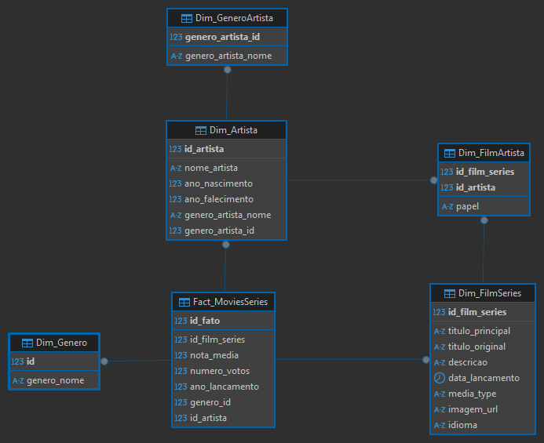
### 2. Criação dos scripts
  ##### Pronto o modelo e tendo a orientação de por onde iniciar comecei a criação dos scripts para meu Job no AWS Glue. Utilizei da mesma lógica do SQL para ir criando meus DataFrames com as colunas e valores que julguei ser pertinentes a cada um, mantendo uma estrutura compatível com o AWS Athena.
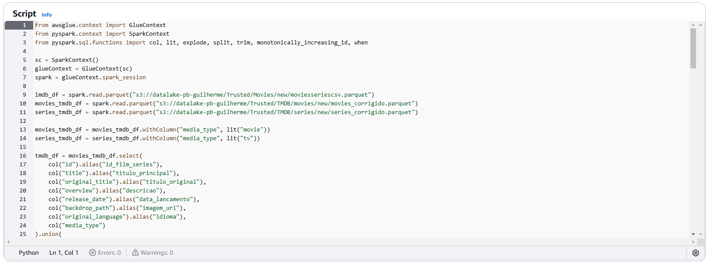
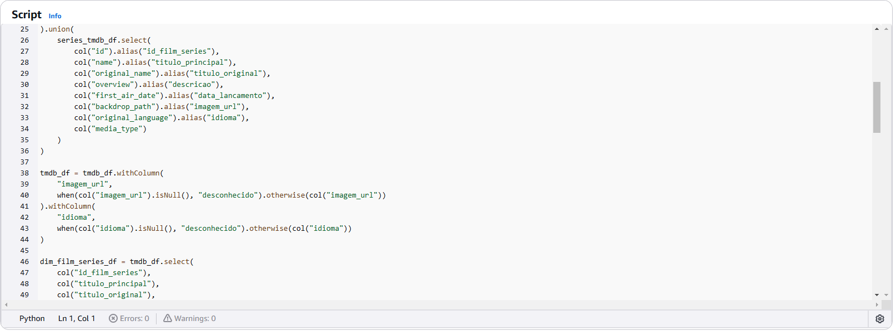
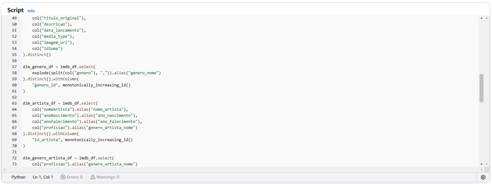
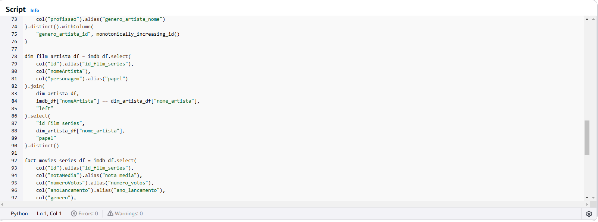
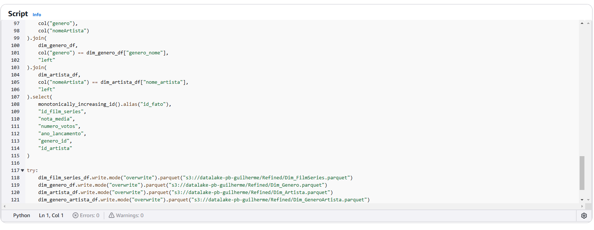
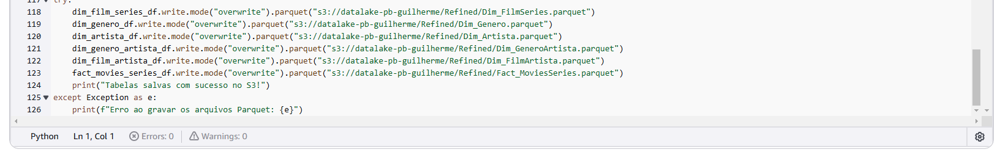
  ##### Ao final da criação salvei novamente em meu Bucket AWS S3, porém dessa vez na camada Refined, para melhor organização, como mostrarei posteriormente, movi os arquivos para a pasta DataFrames.
  ##### Ao verificar os dados vi a necessidade da criação de um segundo script para um novo Job pois duas de minhas tabelas não estavam corretas, então refiz apenas as duas padronizando assim para que ficassem organizadas seguindo o restante dos dados
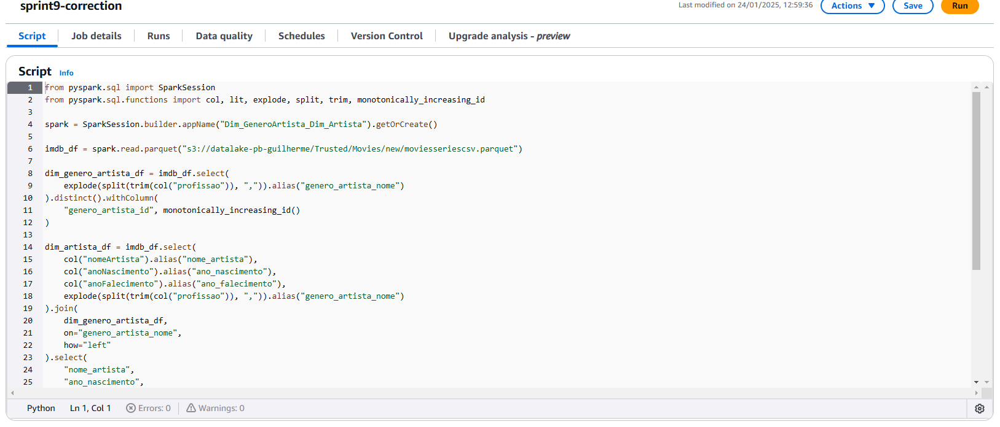
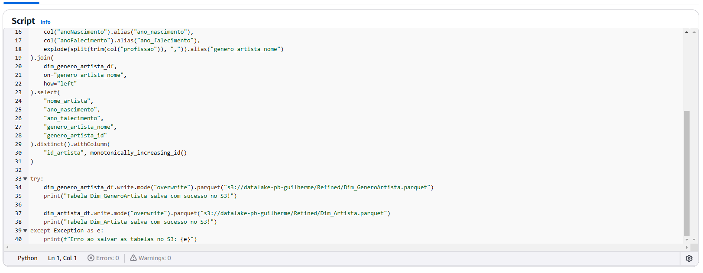
### 3. Resultados dos Buckets
  ##### O resultado foi a criação dos arquivos agora na camada Refined com os dados prontos para serem já consumidos pelo AWS QuickSight, aqui primeiramente vejos a execução com sucesso do Job 1
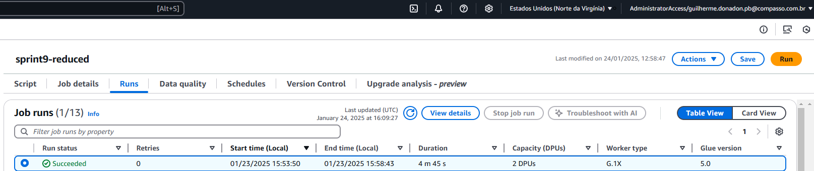
  ##### E então, o segundo Job
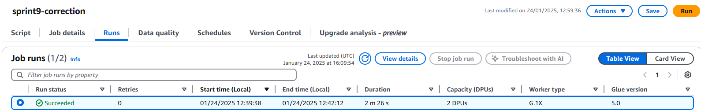
### 4. Criação de Tabelas no Glue Catalog
  ##### Logo após a execução dos Jobs e a confirmação de seu sucesso no Bucket criei o Crawler que seria responsável pela correta criação das tabelas.

  ##### Após executado o Crawler vemos o resultado
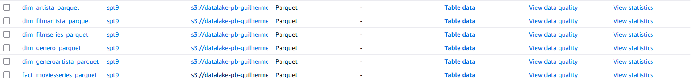
  ##### Rodei uma Query no AWS Athena para ter certeza da correta execução do Crawler, Criação das Tabelas e Padronização dos dados.
  ##### A Query foi
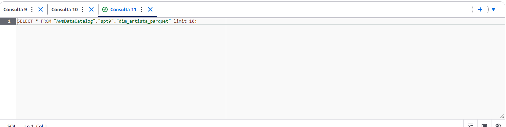
  ##### E obtive o resultado:
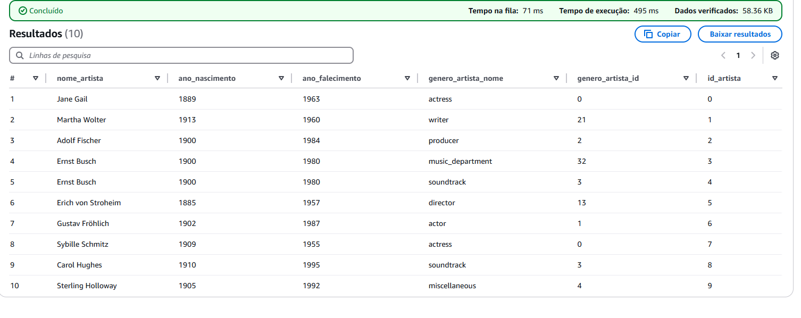
### 5. Organização dos Buckets
  ##### Após a execução dos Jobs conferi em meu bucket os arquivos criados e como resultado tive outros como o seguinte exemplo
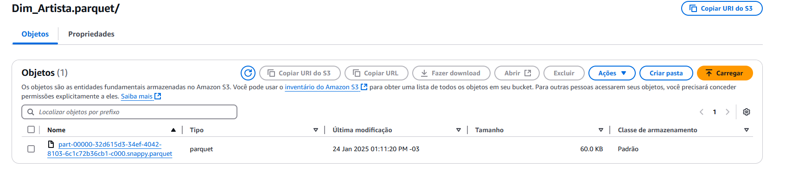
  ##### Os dados foram organizados dentro do bucket para melhor visualização da seguinte forma:
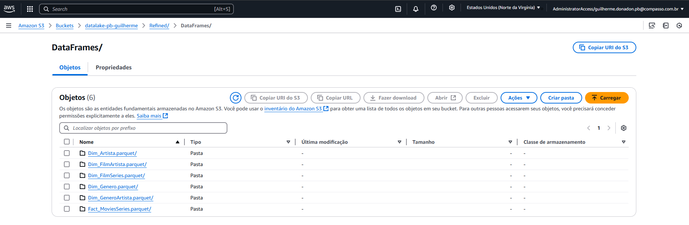
  ##### E Por fim baixei um dos arquivos para ter certeza da estrutura também em outros ambientes além da AWS e executei uma query e a estruturação e consistência dos dados se mantiveram
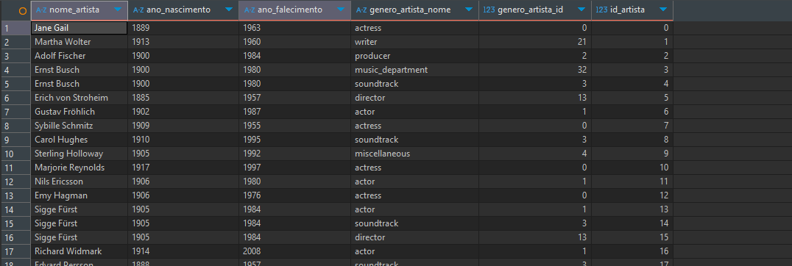

### 6. Links Úteis
  #### [Certificados](/Sprint_9/Certificados) 
  #### [Evidencias](/Sprint_9/Evidencias)
  #### [Exercícios](/Sprint_9/Exercicios)

